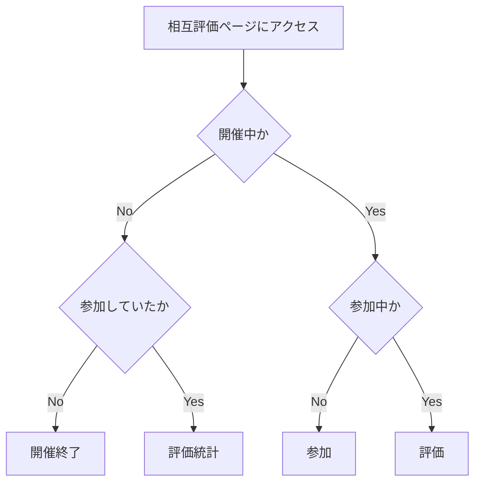
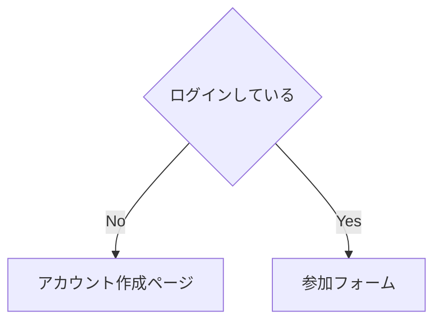
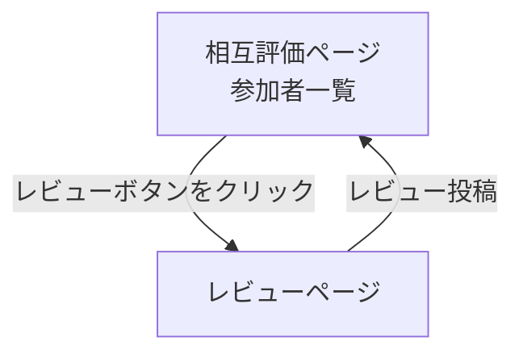

# 相互評価機能

できるだけ個人情報を握りたくないので、生徒はゲストユーザーとして参加可能。

## 遷移

```mermaid
flowchart TD

visit_show[相互評価ページにアクセス]
if_doing{開催中か}
if_participating{参加中か}
if_participated{参加していたか}
participation[参加]
review[評価]
review_result[評価統計]
finished[開催終了]

visit_show --> if_doing
if_doing -->|No| if_participated
if_doing -->|Yes| if_participating

if_participated -->|No| finished
if_participated -->|Yes| review_result

if_participating -->|No| participation
if_participating -->|Yes| review
```

### 参加

```mermaid
flowchart TD

if_sigged_in{ログインしている}
to_sign_in[アカウント作成ページ]
participation_form[参加フォーム]

if_sigged_in -->|No| to_sign_in
if_sigged_in -->|Yes| participation_form
```

### 評価

```mermaid
flowchart TD

show_page[相互評価ページ\n参加者一覧]
review_page[レビューページ]

show_page -->|レビューボタンをクリック| review_page
review_page -->|レビュー投稿| show_page
```
