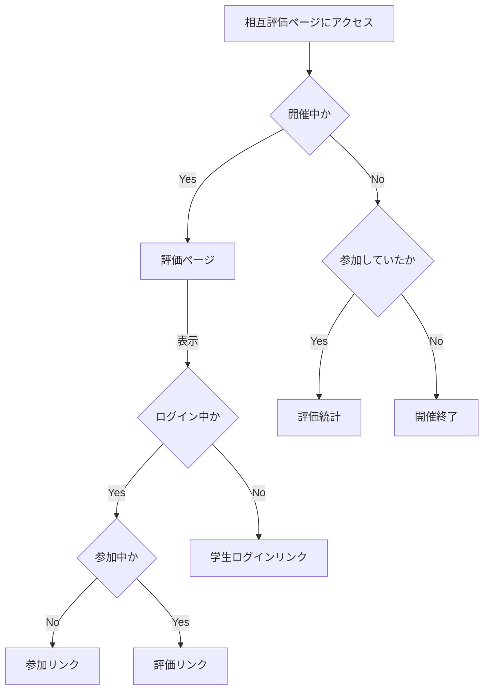

# 相互評価機能

複数のユーザーが参加し、相互に点数をつけ、コメントを書き、最後にリザルトを表示する機能。

## 遷移

```mermaid
flowchart TD

visit_show[相互評価ページにアクセス]
if_doing{開催中か}
if_logged_in{ログイン中か}
if_participating{参加中か}
if_participated{参加していたか}
review_page[評価ページ]
review_result[評価統計]
finished[開催終了]
show_student_sign_in_link[学生ログインリンク]
show_participation_link[参加リンク]
show_review_links[評価リンク]

visit_show --> if_doing
if_doing -->|No| if_participated
if_doing -->|Yes| review_page

if_participated -->|No| finished
if_participated -->|Yes| review_result

review_page -->|表示| if_logged_in
if_logged_in -->|No| show_student_sign_in_link
if_logged_in -->|Yes| if_participating

if_participating -->|No| show_participation_link
if_participating -->|Yes| show_review_links
```
